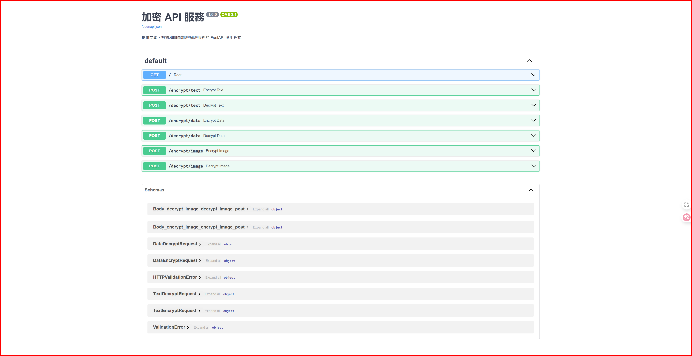

# 加密 API 服務

一個基於 FastAPI 的全功能加密服務，支持文本、數據和圖像的加密/解密操作。



## 🌟 特性

- **多種加密算法**：支持 AES 和 Fernet 加密算法
- **文本加密**：安全的文本加密和解密服務
- **數據加密**：通用數據加密，支持多種算法
- **圖像加密**：專門的圖像文件加密功能
- **RESTful API**：標準的 REST API 接口
- **安全性**：使用 PBKDF2 密鑰派生函數增強安全性
- **易於使用**：清晰的 API 文檔和響應格式

## 📁 項目結構

```
PasswordApp/
├── main.py                    # FastAPI 主應用程式
├── encryption/                # 加密模組目錄
│   ├── __init__.py           # 模組初始化文件
│   ├── text_encryption.py    # 文本加密模組
│   ├── data_encryption.py    # 數據加密模組
│   └── image_encryption.py   # 圖像加密模組
├── requirements.txt          # Python 依賴項
└── README.md                # 項目文檔
```

## 🚀 快速開始

### 1. 安裝依賴

```bash
pip install -r requirements.txt
```

### 2. 啟動服務

```bash
python main.py
```

或使用 uvicorn：

```bash
uvicorn main:app --host 0.0.0.0 --port 8000 --reload
```

### 3. 訪問 API

服務啟動後，可以通過以下地址訪問：

- **API 服務**：http://localhost:8000
- **API 文檔**：http://localhost:8000/docs
- **ReDoc 文檔**：http://localhost:8000/redoc

## 📚 API 端點

### 基本信息

#### GET `/`
獲取 API 服務基本信息和可用端點列表。

**響應示例：**
```json
{
  "message": "歡迎使用加密 API 服務",
  "endpoints": {
    "text_encrypt": "/encrypt/text",
    "text_decrypt": "/decrypt/text",
    "data_encrypt": "/encrypt/data",
    "data_decrypt": "/decrypt/data",
    "image_encrypt": "/encrypt/image",
    "image_decrypt": "/decrypt/image"
  }
}
```

### 文本加密

#### POST `/encrypt/text`
加密文本數據。

**請求體：**
```json
{
  "text": "要加密的文本",
  "password": "加密密碼"
}
```

**響應示例：**
```json
{
  "status": "success",
  "encrypted_text": "gAAAAABhXXXXXXXXXXXXXXXXXXXXXXXX...",
  "message": "文本加密成功"
}
```

#### POST `/decrypt/text`
解密文本數據。

**請求體：**
```json
{
  "encrypted_text": "gAAAAABhXXXXXXXXXXXXXXXXXXXXXXXX...",
  "password": "解密密碼"
}
```

### 數據加密

#### POST `/encrypt/data`
加密通用數據，支持多種算法。

**請求體：**
```json
{
  "data": "要加密的數據",
  "password": "加密密碼",
  "algorithm": "AES"  // 可選：AES 或 Fernet，默認為 AES
}
```

#### POST `/decrypt/data`
解密通用數據。

**請求體：**
```json
{
  "encrypted_data": "加密後的數據",
  "password": "解密密碼",
  "algorithm": "AES"  // 必須與加密時使用的算法一致
}
```

### 圖像加密

#### POST `/encrypt/image`
加密圖像文件。

**請求參數：**
- `password`：字符串，加密密碼
- `file`：上傳的圖像文件

**響應：**
返回加密後的文件下載。

#### POST `/decrypt/image`
解密圖像文件。

**請求參數：**
- `password`：字符串，解密密碼  
- `file`：上傳的加密文件（.enc 格式）

**響應：**
返回解密後的圖像文件。

## 🔧 使用示例

### Python 客戶端示例

```python
import requests
import json

# API 基礎 URL
BASE_URL = "http://localhost:8000"

# 文本加密示例
def encrypt_text_example():
    url = f"{BASE_URL}/encrypt/text"
    data = {
        "text": "這是一個秘密訊息",
        "password": "my_secret_password"
    }
    response = requests.post(url, json=data)
    print("加密響應:", response.json())
    return response.json()["encrypted_text"]

# 文本解密示例
def decrypt_text_example(encrypted_text):
    url = f"{BASE_URL}/decrypt/text"
    data = {
        "encrypted_text": encrypted_text,
        "password": "my_secret_password"
    }
    response = requests.post(url, json=data)
    print("解密響應:", response.json())

# 圖像加密示例
def encrypt_image_example():
    url = f"{BASE_URL}/encrypt/image"
    with open("example.jpg", "rb") as f:
        files = {"file": ("example.jpg", f, "image/jpeg")}
        data = {"password": "image_password"}
        response = requests.post(url, files=files, data=data)
    
    # 保存加密文件
    with open("encrypted_image.enc", "wb") as f:
        f.write(response.content)
    print("圖像加密完成")

# 執行示例
if __name__ == "__main__":
    # 加密和解密文本
    encrypted = encrypt_text_example()
    decrypt_text_example(encrypted)
    
    # 加密圖像（需要有 example.jpg 文件）
    # encrypt_image_example()
```

### cURL 示例

```bash
# 文本加密
curl -X POST "http://localhost:8000/encrypt/text" \
     -H "Content-Type: application/json" \
     -d '{"text": "Hello World", "password": "mypassword"}'

# 數據加密（使用 Fernet 算法）
curl -X POST "http://localhost:8000/encrypt/data" \
     -H "Content-Type: application/json" \
     -d '{"data": "Important data", "password": "mypassword", "algorithm": "Fernet"}'

# 圖像加密
curl -X POST "http://localhost:8000/encrypt/image" \
     -F "password=imagepass" \
     -F "file=@image.jpg" \
     -o encrypted_image.enc
```

## 🔐 安全特性

1. **PBKDF2 密鑰派生**：使用 100,000 次迭代增強密碼安全性
2. **隨機鹽值**：每次加密使用不同的隨機鹽值
3. **安全算法**：支持 AES-256 和 Fernet 加密算法
4. **數據完整性**：包含文件頭和大小驗證
5. **內存安全**：使用臨時文件處理大型數據

## 🛠️ 支持的算法

### 文本加密
- **Fernet**：對稱加密算法，提供身份驗證和完整性保護

### 數據加密
- **AES-256-CBC**：高級加密標準，256位密鑰，CBC 模式
- **Fernet**：基於 AES-128 的高級對稱加密

### 圖像加密
- **AES-256-CBC**：專門優化的圖像數據加密

## 📝 開發說明

### 添加新的加密算法

1. 在相應的加密模組中添加新的方法
2. 更新 `supported_algorithms` 列表
3. 在主 API 中添加相應的處理邏輯

### 環境變量配置

可以創建 `.env` 文件來配置環境變量：

```env
# 服務器配置
HOST=0.0.0.0
PORT=8000
DEBUG=False

# 安全配置
SECRET_KEY=your-secret-key-here
ALGORITHM_DEFAULT=AES
```

## 🐛 故障排除

### 常見問題

1. **依賴安裝失敗**
   ```bash
   pip install --upgrade pip
   pip install -r requirements.txt
   ```

2. **端口被占用**
   ```bash
   # 修改端口
   uvicorn main:app --port 8001
   ```

3. **加密/解密失敗**
   - 確保密碼正確
   - 檢查算法類型是否一致
   - 驗證輸入數據格式

## 📄 授權

此項目使用 MIT 授權條款。詳見 LICENSE 文件。

## 🤝 貢獻

歡迎提交 Issue 和 Pull Request 來改進此項目。

## 📞 聯繫方式

如有問題或建議，請通過以下方式聯繫：

- 創建 GitHub Issue
- 發送郵件至：[your-email@example.com]

---

**注意：** 請妥善保管您的加密密碼，密碼丟失將無法恢復加密數據。 